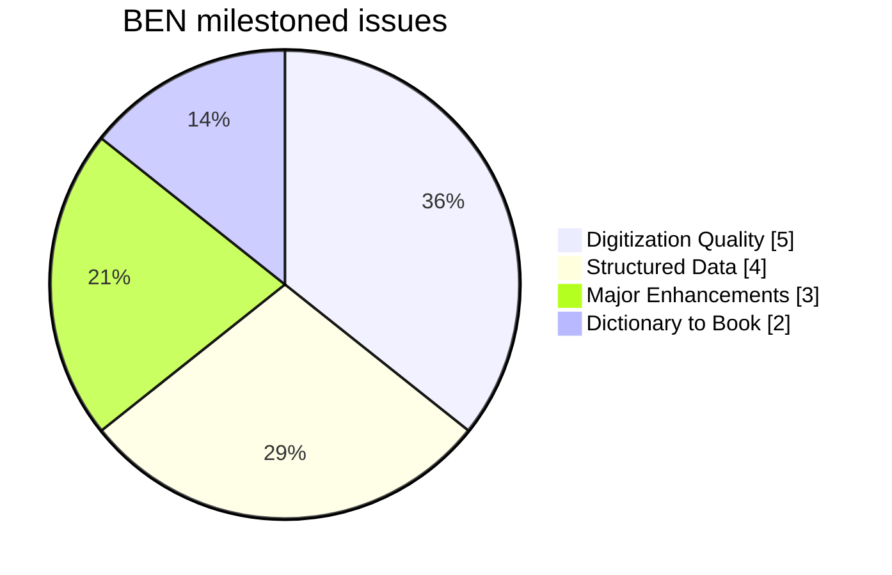
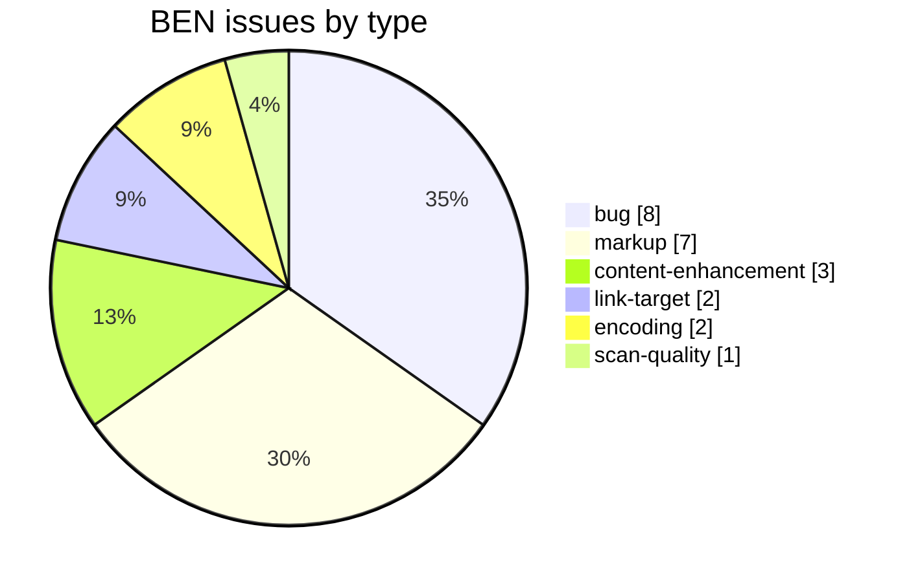
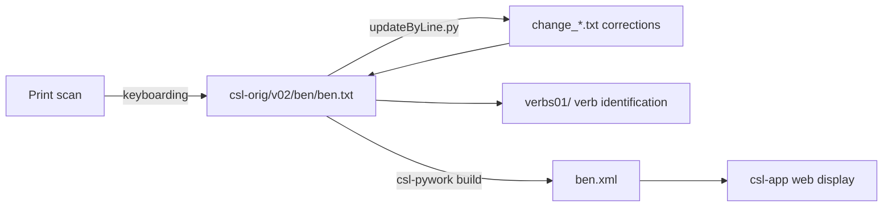

# BEN — Benfey *A Sanskrit-English Dictionary* (1866)

_Created: 30-04-2020 · Last updated: 14-07-2026_

Development and correction repository for **Theodor Benfey's *A Sanskrit-English Dictionary***, a Sanskrit→English dictionary, part of the [Cologne Digital Sanskrit Lexicon](https://www.sanskrit-lexicon.uni-koeln.de/) (CDSL). The canonical source text lives in [`csl-orig/v02/ben/ben.txt`](https://github.com/sanskrit-lexicon/csl-orig/blob/main/v02/ben/ben.txt) (17,036 entries); this repository holds the development, correction, and enrichment work.

Notable for comparative/etymological notes, including Greek cognates (`<lang n="greek">`).

## Documentation

- [CLAUDE.md](https://github.com/sanskrit-lexicon/BEN/blob/main/CLAUDE.md) — repository guide and data-format reference.
- [DATA_DICTIONARY.md](https://github.com/sanskrit-lexicon/BEN/blob/main/DATA_DICTIONARY.md) — markup tag reference.
- [CONTRIBUTING.md](https://github.com/sanskrit-lexicon/BEN/blob/main/CONTRIBUTING.md) · [CODE_OF_CONDUCT.md](https://github.com/sanskrit-lexicon/BEN/blob/main/CODE_OF_CONDUCT.md)

## Contents

| Path | Purpose |
|---|---|
| [`2021-10-02/`](https://github.com/sanskrit-lexicon/BEN/tree/main/2021-10-02) | Page-column (`pc`) correction scripts and error lists |
| [`abbrev/`](https://github.com/sanskrit-lexicon/BEN/tree/main/abbrev) | Abbreviation-markup preparation (`ab`/`ls`/`ea` word lists + statistics) |
| [`ben_ab/`](https://github.com/sanskrit-lexicon/BEN/tree/main/ben_ab) | Abbreviation analysis scripts and Cologne-comparison files |
| [`eng_error_lang/`](https://github.com/sanskrit-lexicon/BEN/tree/main/eng_error_lang) | Comparative-language word lists (Anglo-Saxon, Gothic, Latin, OHG, etc.) |
| [`greek/`](https://github.com/sanskrit-lexicon/BEN/tree/main/greek) | Greek-text corrections and change files |
| [`issues/`](https://github.com/sanskrit-lexicon/BEN/tree/main/issues) | Per-issue working files |
| [`verbs01/`](https://github.com/sanskrit-lexicon/BEN/tree/main/verbs01) | Verb/preverb/upasarga identification: maps verb entries to MW roots, with Devanāgarī renderings |

## Timeline

| Period | Activity |
|---|---|
| 2020 | Repository activity begins (first tracked issues) |
| 2021–2024 | Ongoing corrections, markup, and comparison work (LS/AB study cluster, Greek, verbs) |
| 2026 | Issue taxonomy, citation metadata, documentation |

## Projects & Milestones

Live counts (milestone-assigned issues only) as of the last update:

| Milestone | Open | Closed | Total |
|---|---|---|---|
| Dictionary to Book | 2 | 0 | 2 |
| Digitization Quality | 1 | 4 | 5 |
| Structured Data | 0 | 4 | 4 |
| Major Enhancements | 2 | 1 | 3 |
| **Total** | **5** | **9** | **14** |

A further 13 closed issues (mostly the 2021–2024 LS/AB study cluster) carry no milestone, so the repository has 27 issues in total.

## Issues

### Open

| # | Title | Type | Severity | Milestone |
|---|---|---|---|---|
| [1](https://github.com/sanskrit-lexicon/BEN/issues/1) | verbs01 | content-enhancement | medium | Major Enhancements |
| [11](https://github.com/sanskrit-lexicon/BEN/issues/11) | docs-pass: BEN documentation review | content-enhancement | medium | Major Enhancements |
| [27](https://github.com/sanskrit-lexicon/BEN/issues/27) | Web Display — Tracker for the BEN links | link-target | hard | Dictionary to Book |
| [28](https://github.com/sanskrit-lexicon/BEN/issues/28) | [markup] Upgrade sub-headwords to headwords | markup | medium | Digitization Quality |
| [30](https://github.com/sanskrit-lexicon/BEN/issues/30) | BEN LS pdf sources | link-target | medium | Dictionary to Book |

### Solved

| # | Title | Type |
|---|---|---|
| [2](https://github.com/sanskrit-lexicon/BEN/issues/2) | Abbreviation markup | markup |
| [3](https://github.com/sanskrit-lexicon/BEN/issues/3) | Addl. strings for ab, ls and bot markings | markup |
| [4](https://github.com/sanskrit-lexicon/BEN/issues/4) | New scanned images | scan-quality |
| [5](https://github.com/sanskrit-lexicon/BEN/issues/5) | Mine Andhrabharati's version | content-enhancement |
| [6](https://github.com/sanskrit-lexicon/BEN/issues/6) | Greek text | encoding |
| [7](https://github.com/sanskrit-lexicon/BEN/issues/7) | oM, o~, and Unicode Character 'DEVANAGARI OM' | bug |
| [8](https://github.com/sanskrit-lexicon/BEN/issues/8) | Greek text proofreading | encoding |
| [9](https://github.com/sanskrit-lexicon/BEN/issues/9) | Replacing ben_hwextra with Lbody | markup |
| [10](https://github.com/sanskrit-lexicon/BEN/issues/10) | [markup] Minor ben.txt Markup Oddities | markup |
| [14](https://github.com/sanskrit-lexicon/BEN/issues/14) | BEN AB tags study | — |
| [15](https://github.com/sanskrit-lexicon/BEN/issues/15) | BEN LS study | — |
| [16](https://github.com/sanskrit-lexicon/BEN/issues/16) | Adjust malformed LS if any | — |
| [18](https://github.com/sanskrit-lexicon/BEN/issues/18) | [bug] LS questionable literary sources | bug |
| [19](https://github.com/sanskrit-lexicon/BEN/issues/19) | [markup] Make LS consistent with PWG methods | markup |
| [20](https://github.com/sanskrit-lexicon/BEN/issues/20) | [bug] non space items after LS | bug |
| [21](https://github.com/sanskrit-lexicon/BEN/issues/21) | [bug] LS Gorr. | bug |
| [22](https://github.com/sanskrit-lexicon/BEN/issues/22) | [bug] Bare digits which may be LS | bug |
| [23](https://github.com/sanskrit-lexicon/BEN/issues/23) | [bug] Fix page number references | bug |
| [24](https://github.com/sanskrit-lexicon/BEN/issues/24) | [bug] Missing LS references outside ls tag | bug |
| [25](https://github.com/sanskrit-lexicon/BEN/issues/25) | [bug] digits preceded and followed by semicolon | bug |
| [26](https://github.com/sanskrit-lexicon/BEN/issues/26) | Analyze the newly formed BEN with LS markup per PWG style | — |
| [29](https://github.com/sanskrit-lexicon/BEN/issues/29) | [markup] AB to LEX | markup |

## Labels

### Type labels

| Label | Meaning |
|---|---|
| `link-target` | Click-throughs from `<ls>` abbreviations to scanned PDF pages |
| `link-splitting` | Splitting combined `SOURCE N,N` refs into per-page links |
| `markup` | Normalising XML tag content |
| `text-correction` | Corrections to English/Sanskrit definitions or headwords |
| `content-enhancement` | New material or structural additions beyond correction |
| `encoding` | SLP1/IAST transcoding, character normalisation |
| `scan-quality` | Replacing blurry/skewed/missing scan pages |
| `bug` | Broken links, XML errors, broken downloads |
| `question` | Scholarly questions requiring research |

### Severity labels

| Label | Meaning |
|---|---|
| `minor` | Targeted fix — a handful of lines or a single file |
| `medium` | Standard unit of work — one batch of corrections |
| `hard` | Large effort spanning many sources or files |

## Contributors

Combined git-history commit counts (bots excluded):

| Contributor | Commits |
|---|---|
| Dr. Dhaval Patel (drdhaval2785) | 92 |
| Mārcis Gasūns (gasyoun) | 26 |
| funderburkjim (Jim Funderburk) | 20 |
| AnnaRybakovaT | 1 |

## Source

- **Author**: Benfey, Theodor
- **Title**: *A Sanskrit-English Dictionary*
- **Place / Publisher**: London: Longmans, Green
- **Year(s)**: 1866
- **Language pair**: Sanskrit → English
- **Size (CDSL headword index)**: 17,036 entries
- **License (digital edition)**: CC BY-SA 4.0
- See [CITATION.cff](https://github.com/sanskrit-lexicon/BEN/blob/main/CITATION.cff) for machine-readable citation.

## Encoding

- UTF-8 (NFC) throughout.
- Sanskrit text in SLP1 transliteration, wrapped in `{#…#}`; English gloss / italic display text in ``.
- Devanāgarī and IAST display forms are generated at display time, not stored in the source.

## Corrections workflow

Corrections are never made to the canonical source directly — they are expressed as change files (`old`/`new`/`ins`/`del` paired lines) applied by `updateByLine.py`. The full 8-stage workflow, change-file format, and every gotcha (BOM, `<LEND>`, CRLF, line-count mismatch) live in the canonical [csl-corrections/docs/correction-workflow.md](https://github.com/sanskrit-lexicon/csl-corrections/blob/main/docs/correction-workflow.md).

## How it works

---
*Issue taxonomy and documentation per the [Cologne issue runbook](https://github.com/sanskrit-lexicon/csl-observatory/blob/main/runbook/cologne-issue-runbook.md).*

_Dr. Mārcis Gasūns_
